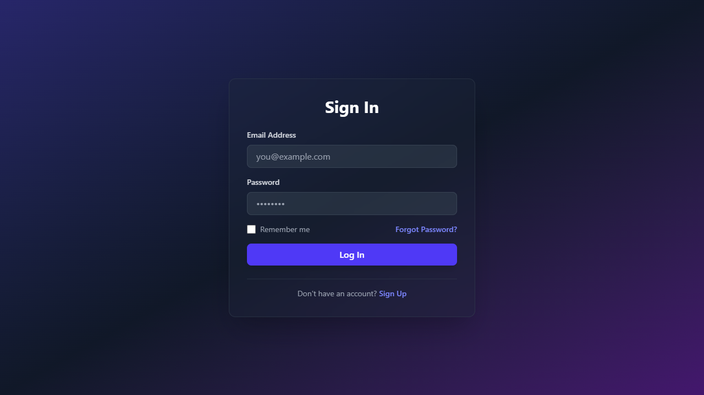
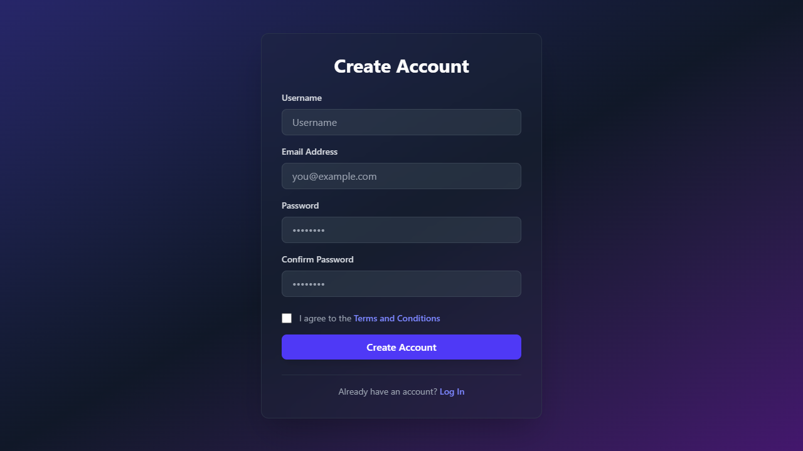
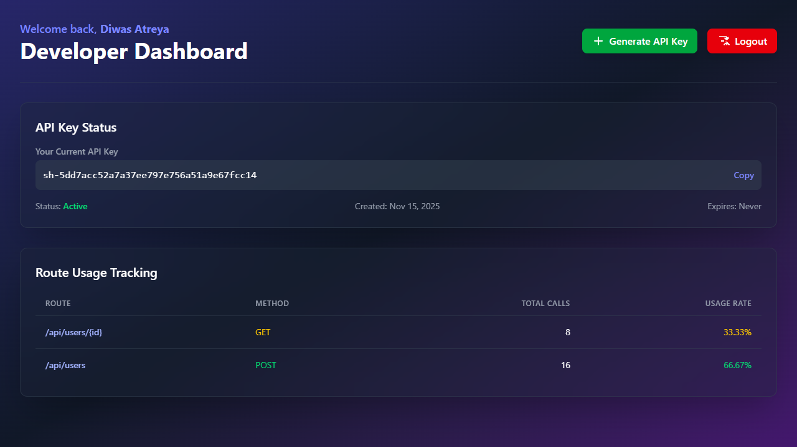

A simple and secure API system that requires an API token to access protected api routes.

## Features
- Token-based authentication (via Bearer token)
- Protected routes accessible only with valid tokens
- Middleware for validating tokens
- JSON responses for success and error handling
- Easy to extend for real projects (user systems, rate limits, dashboards, etc.)

## Technologies Used

- Frontend: HTML, CSS, JS
- Backend: NodeJS, ExpressJS
- Database: MongoDB

## Usage

1. Clone the repository
2. Create the `.env` file & fill the value
3. Start your server using `node --watch server`

## PREVIEW

Login Page:

Signup Page:

Home Page:

## License

This project is licensed under the MIT. See the [LICENSE](LICENSE) file for details.

## Support
Free free to ⭐ fork/start or to contribute on the repository and make sure to follow [Diwas Atreya](https://github.com/diwasatreya)